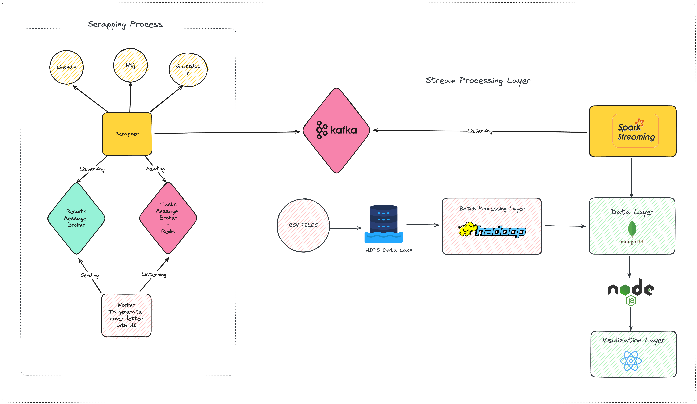
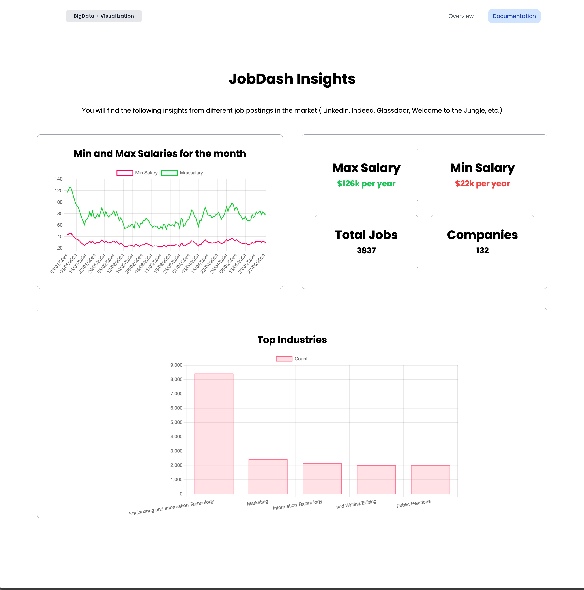

# Scrappi Project

This project showcases a job scraping and application automation platform named Scrappi. It automates job searches, scrapes recruiter emails, and generates personalized cover letters for users. The platform leverages technologies like Puppeteer, Kafka, Spark, Hadoop, Celery, and Next.js to provide a comprehensive and efficient solution for job seekers.

## Table of Contents
- Introduction
- Data Pipeline
- Dataset
- Batch Processing Layer
- Streaming Layer
- Data Storage and Visualization
- Demo

## Introduction
Scrappi is a platform designed to automate the job search and application process. It scrapes job offers based on user criteria from multiple platforms, collects recruiter emails, and generates personalized cover letters for each job offer. The goal is to streamline the job application process and enhance user experience and satisfaction.

## Data Pipeline
The following image shows our pipeline's architecture:

## Dataset
The dataset contains job offers with the following fields:
- Job Title
- Company Name
- Location
- Job Description
- Recruiter Email (if available)
- Application Link
- ... (additional fields)

## Technologies Overview
This section provides a brief overview of the technologies used in this project and their role in job scraping and application automation.

- **Puppeteer**: Puppeteer is a Node library which provides a high-level API to control headless Chrome or Chromium. It is used to automate the job scraping process, collecting job offers from multiple platforms based on user criteria.

- **Hadoop**: Hadoop is an open-source framework that enables distributed storage and processing of large datasets using the MapReduce programming model. It provides a scalable, cost-effective solution for processing batch data in this project.

- **Kafka**: Apache Kafka is a distributed streaming platform that handles high-throughput, fault-tolerant, and scalable real-time data streaming. In this project, Kafka is used for event streaming, ensuring real-time updates and efficient data processing.

- **Spark**: Apache Spark is a unified analytics engine for large-scale data processing. Spark Streaming is used for processing live data streams, providing real-time analytics and updates for the job offers.

- **MongoDB**: MongoDB is a NoSQL database that stores data in flexible, JSON-like documents. It allows for a dynamic and scalable data model, making it well-suited for storing job offers and application data.

- **Celery**: Celery is an asynchronous task queue/job queue based on distributed message passing. It is used to handle the generation of personalized cover letters for each job offer using AI.

- **Next.js**: Next.js is a React framework that enables server-side rendering and generating static websites for React-based web applications. It is used to display all results, including job details and cover letters, on a user-friendly dashboard.

## Batch Processing Layer
In the batch processing layer, Hadoop MapReduce is used to process the collected job data stored in HDFS, preparing it for further analysis and storage.

## Streaming Layer
In the streaming layer, Apache Spark Streaming is used to process the streaming data. Spark Streaming consumes the data from the Kafka topic, providing real-time updates and analytics for the job offers.

## Data Storage and Visualization
The processed data is stored in a MongoDB database and sent through a Node server to be visualized on a Next.js dashboard. Users can view job details, download personalized cover letters in PDF format, and export job offers and descriptions as a CSV file.

## Demo

## Collaborators

[Firas Mosbahi](https://github.com/FirasMosbahi)

[Amine Guesmi](https://github.com/amineXguesmi)

## Remarks
Please note that the scraping code and project are not included in this repository. For any details or further information, please contact me.